# tmp_assignment_mod_20

Task Manager App (TM Project)
A Flutter-based Task Management application to track, update, and manage daily tasks efficiently.

## Getting Started

App Screenshots

### 1. Log in screen
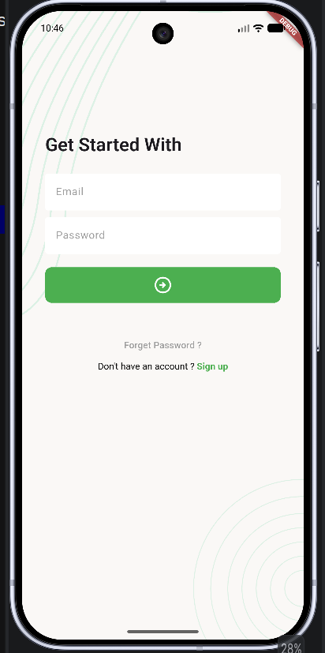

### 2. Forgot password
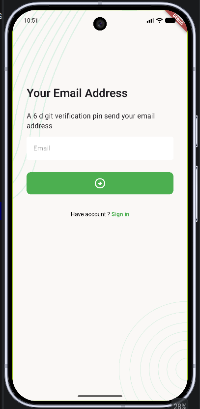
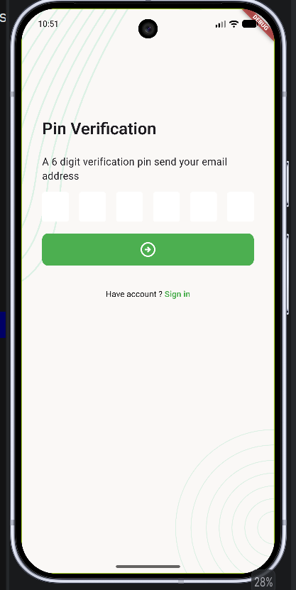
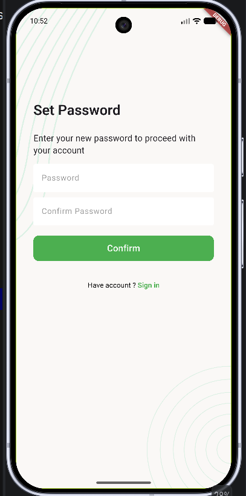

### 3. Sign Up [ This is dynamic ]
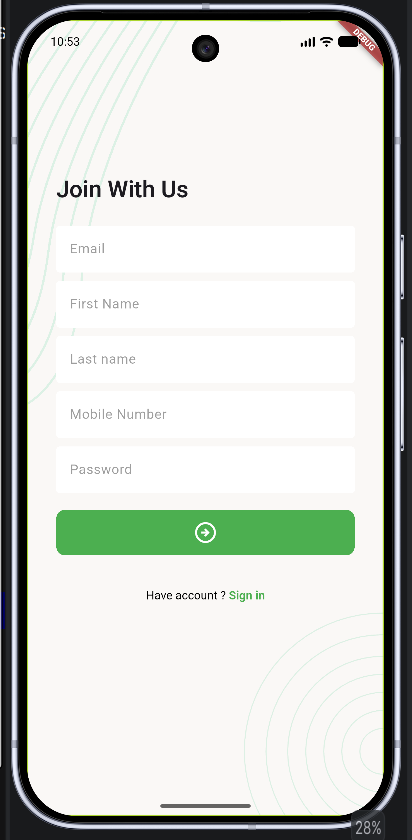
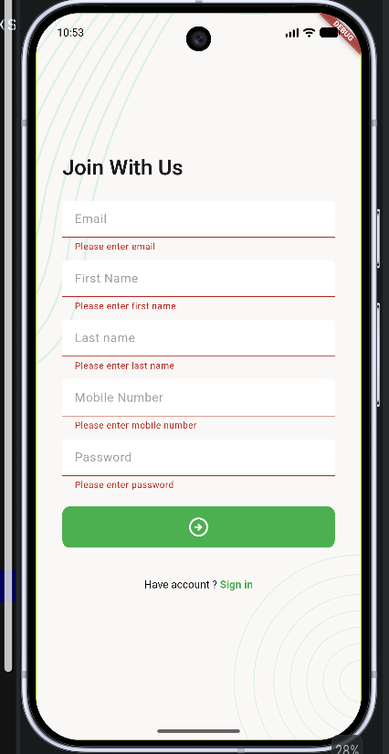

### 4. New Screen
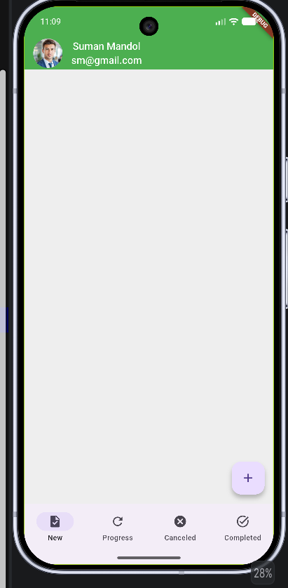

### 5. Add New Task
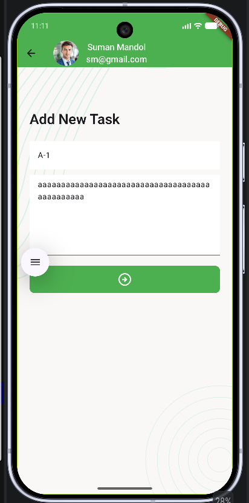
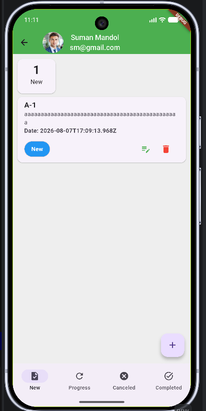
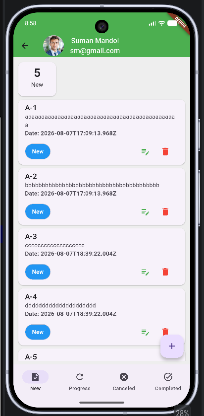

### 6. Update Task
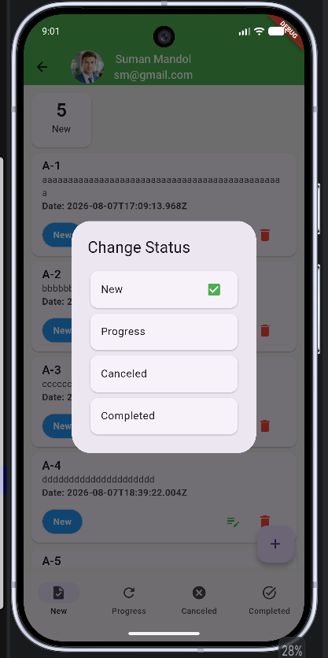
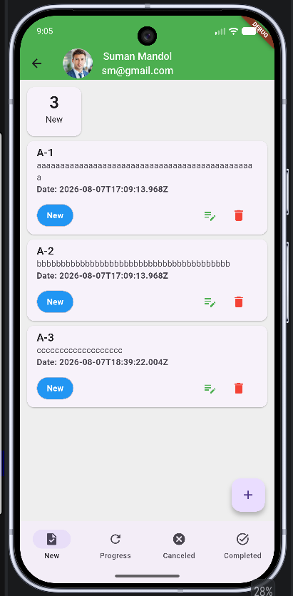
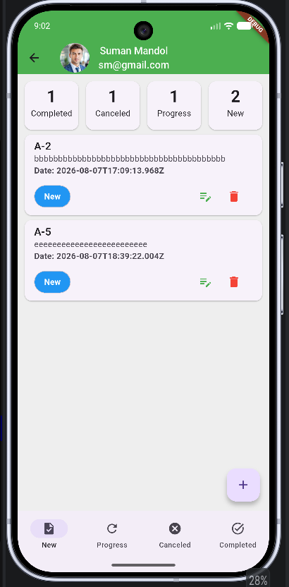
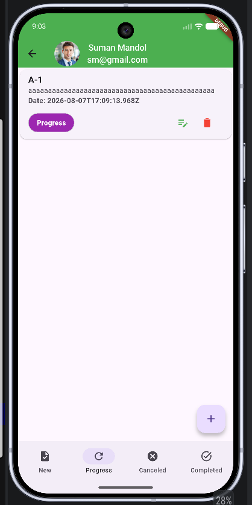
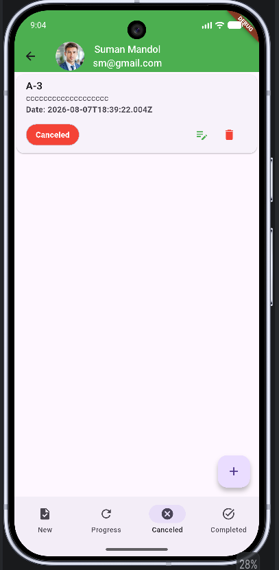
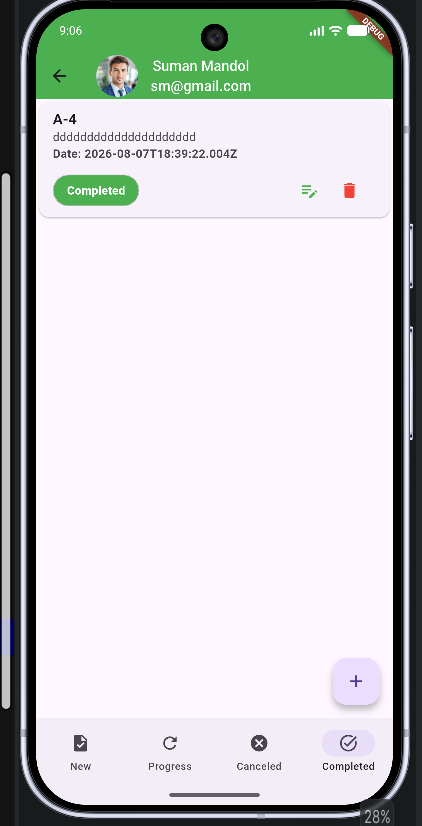

### 7. Update Profile [ This is dynamic ]
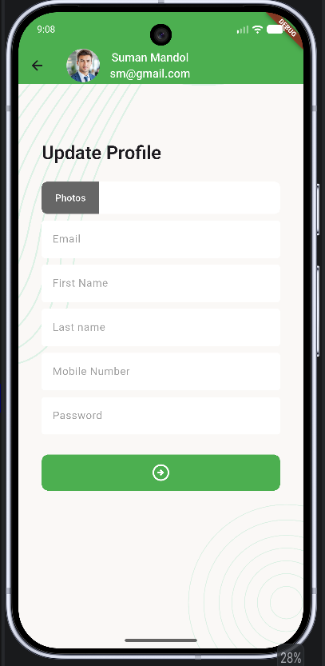
### When user tap the photo field then it takes photo from own device. 
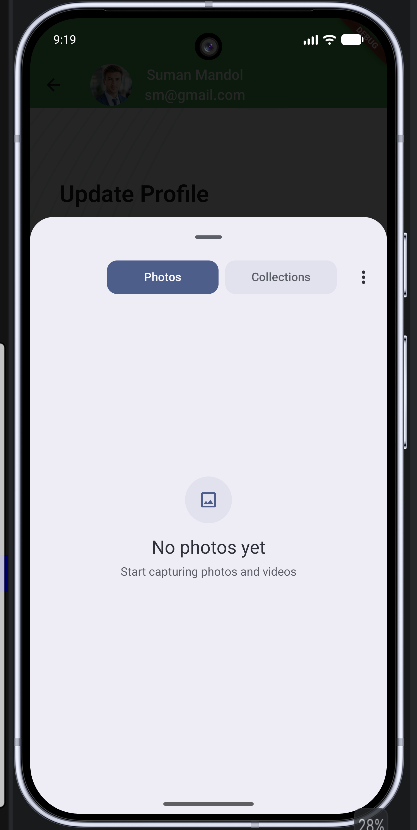
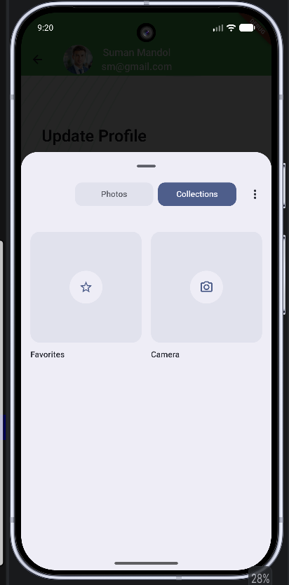

